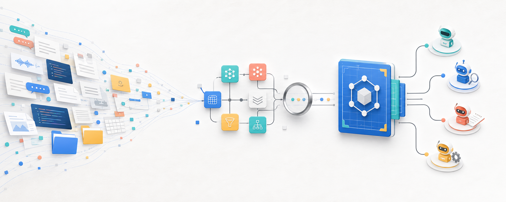
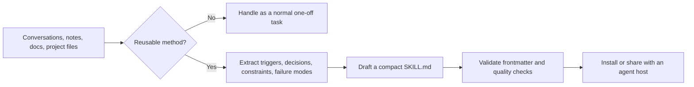

# learn-anything

<p align="center">
  
</p>

<p align="center">
  <a href="README.zh-CN.md"></a>
  <a href="README.md"></a>
</p>

`learn-anything` is a portable meta-skill for turning conversations, transcripts, project notes, folder workflows, documentation, and other source material into reusable agent skills.

The core rule is simple: extract repeatable operating methods, not passive summaries.

## What It Does

- Detects whether a request contains reusable workflow knowledge or is only a one-off task.
- Extracts triggers, decisions, commands, constraints, failure modes, and verification gates.
- Produces compact `SKILL.md` guidance that can be adapted by different agent hosts.
- Includes deterministic Python hooks for pre-task gating, post-task reflection, and candidate generation.

## Compatible Agents

The skill is not tied to one runtime. It can be used by any agent host that can read Markdown instructions and, optionally, run the bundled Python scripts.

- OpenAI Codex
- Claude Code
- Gemini CLI
- Cursor agents
- Windsurf agents
- GitHub Copilot coding agent
- Aider
- OpenCode
- Roo Code
- Continue
- CrewAI agents
- LangGraph agents
- AutoGen agents
- ReAct-style custom agents
- Other coding, research, documentation, or automation agents with Markdown instruction support

## Install

### 1. Clone the repository

```bash
git clone https://github.com/LightDevCoder/learn-anything.git
cd learn-anything
```

The installable skill is the `learn-anything/` directory. Keep `SKILL.md`, `hooks/`, and `agents/` together when copying it.

### 2. Add it to your agent host

For OpenAI Codex, install it under the user skill directory.

```powershell
Copy-Item -Recurse -Force .\learn-anything "$env:USERPROFILE\.codex\skills\learn-anything"
```

On macOS or Linux, the equivalent is:

```bash
cp -R ./learn-anything "$HOME/.codex/skills/learn-anything"
```

For Claude Code, Gemini CLI, Cursor, Windsurf, GitHub Copilot coding agent, Aider, OpenCode, Roo Code, Continue, CrewAI, LangGraph, AutoGen, or a custom agent, copy the same directory into that host's skill or instruction directory and register or reference `learn-anything/SKILL.md` according to the host's convention. The workflow itself does not require a specific runtime.

## Use

### 1. Provide source material

Give the agent a conversation, transcript, project note, folder workflow, documentation page, issue thread, or other source artifact. Include corrections, exact commands, paths, and failure modes when they matter for future reuse.

### 2. Invoke the skill

Named-skill hosts can invoke `learn-anything` or `$learn-anything` when their syntax supports it. Markdown-only hosts can reference `learn-anything/SKILL.md` in the agent's instruction context.

Example request:

```text
Turn these source notes into a reusable agent skill. Extract the trigger,
repeatable workflow, constraints, failure modes, output format, and quality
checks. Do not invent missing details, and validate the resulting SKILL.md.
```

### 3. Review the generated skill

The expected output is a compact skill folder containing:

- YAML frontmatter with only `name` and `description`.
- A description that states what the skill does and when to use it.
- Direct workflow instructions with concrete inputs and outputs.
- Constraints and known failure modes.
- Actionable quality checks before delivery.

## Workflow



## Optional Hooks

The hooks are deterministic helpers. They print JSON and can be called from an agent adapter, CI job, or local shell.

```bash
# Decide whether a request is normal, reusable, or an explicit skill update.
python learn-anything/hooks/learn_gate.py "Create a reusable skill from this workflow"

# Inspect a completed transcript for reusable learning.
python learn-anything/hooks/session_reflector.py tests/fixtures/transcript_with_corrections.txt

# Build a deterministic Skill Creator compatible candidate.
python learn-anything/hooks/skill_candidate_builder.py \
  --source-file tests/fixtures/sample_source.md
```

## Repository Layout

| Path | Purpose |
| --- | --- |
| `learn-anything/SKILL.md` | Installable agent instructions |
| `learn-anything/hooks/learn_gate.py` | Pre-task scoring and mode selection |
| `learn-anything/hooks/session_reflector.py` | Post-task reusable-learning detection |
| `learn-anything/hooks/skill_candidate_builder.py` | Source-to-skill candidate builder |
| `learn-anything/hooks/config.example.json` | Machine-readable hook contract |
| `tests/fixtures/` | Simulated source material and transcripts |
| `tests/test_hooks.py` | Standard-library test suite |

## Verify

Run the repository tests:

```bash
python -m unittest discover -s tests
```

If the Skill Creator validator is installed, run it as well.

```powershell
python "$env:USERPROFILE\.codex\skills\.system\skill-creator\scripts\quick_validate.py" learn-anything
```

```bash
python "$CODEX_HOME/skills/.system/skill-creator/scripts/quick_validate.py" learn-anything
```

## License

This repository does not currently declare a license. Add one before distributing it under an open-source license.
