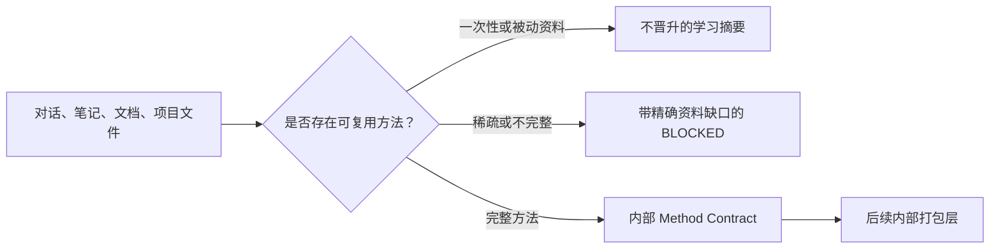

# learn-anything

<p align="center">
  
</p>

<p align="center">
  <a href="README.zh-CN.md"></a>
  <a href="README.md"></a>
</p>

`learn-anything` 是一个便携式 meta-skill，可以把对话、转录稿、项目笔记、文件夹工作流、文档和其他资料，提炼为可复用的 agent skill。

核心原则很简单：提炼可重复执行的方法，而不是生成被动的摘要。

## 功能

- 判断一个请求包含可复用的工作流知识，还是只需要按一次性任务处理。
- 提炼触发条件、决策、命令、约束、失败模式和验证门槛。
- 仅在资料证明方法完整时生成内部 Method Contract。
- 对叙述、一次性工作、被动摘要和稀疏资料，返回明确的“不晋升”学习摘要或带精确资料缺口的 `BLOCKED` 结果。
- 提供确定性的 Python hooks，用于任务前分流、任务后反思和资料充分性评估。

## 兼容的 Agent

这个 skill 不绑定某一种运行时。只要 agent 能读取 Markdown 指令，并且需要时能运行随附的 Python 脚本，就可以使用它。

- OpenAI Codex
- Claude Code
- Gemini CLI
- Cursor agents
- Windsurf agents
- GitHub Copilot coding agent
- Aider
- OpenCode
- Roo Code
- Continue
- CrewAI agents
- LangGraph agents
- AutoGen agents
- ReAct 风格的自定义 agent
- 其他支持 Markdown 指令的编码、研究、文档或自动化 agent

## 安装

### 1. 克隆仓库

```bash
git clone https://github.com/LightDevCoder/learn-anything.git
cd learn-anything
```

可安装的 skill 是 `learn-anything/` 目录。复制时请保留 `SKILL.md`、`hooks/` 和 `agents/` 的完整结构。

### 2. 放入 Agent 宿主

以 OpenAI Codex 为例，将它安装到用户 skill 目录：

```powershell
Copy-Item -Recurse -Force .\learn-anything "$env:USERPROFILE\.codex\skills\learn-anything"
```

macOS 或 Linux 可以使用：

```bash
cp -R ./learn-anything "$HOME/.codex/skills/learn-anything"
```

对于 Claude Code、Gemini CLI、Cursor、Windsurf、GitHub Copilot coding agent、Aider、OpenCode、Roo Code、Continue、CrewAI、LangGraph、AutoGen 或自定义 agent，请按照宿主自身约定，把同一个目录放进 skill 或 instruction 目录，并注册或引用 `learn-anything/SKILL.md`。工作流本身不要求特定运行时。

## 使用

### 1. 提供资料

向 agent 提供对话、转录稿、项目笔记、文件夹工作流、文档页面、issue 讨论或其他源资料。如果它们会影响未来复用，请同时提供修正意见、精确命令、路径和失败模式。

### 2. 调用 Skill

支持命名 skill 的宿主可以调用 `learn-anything`；如果宿主使用 `$` 语法，也可以调用 `$learn-anything`。只支持 Markdown 指令的宿主，则把 `learn-anything/SKILL.md` 放进 agent 的 instruction context。

示例请求：

```text
把这些资料提炼成一个可复用的 agent skill。提取触发条件、可重复工作流、
约束、失败模式、输出格式和质量检查。不要补造缺失细节；先返回
Method Contract 或精确的资料缺口，只有资料完整时才进入后续打包。
```

### 3. 检查资料充分性结果

资料到结果的 hook 有三种输出：

- `method_contract`：**内部**结构化契约，包含目的、触发条件、调用类型、输入、有序方法、决策、约束、失败模式、输出、资源、验证、置信度和未解决缺口。
- `learning_summary`：保留资料，但明确不晋升为 skill；适用于一次性叙述或被动摘要。
- `blocked`：明确不晋升为 skill，并逐项列出学习可复用方法所缺的资料。

该 hook 绝不会靠通用默认内容生成可用于生产的 `SKILL.md`。打包生成属于后续内部层，只能从完整的 Method Contract 开始。

## 工作流



## 可选 Hooks

这些 hooks 是确定性的辅助工具，会输出 JSON，可以从 agent 适配器、CI 任务或本地终端调用。

```bash
# 判断请求应该按普通任务、可复用观察，还是明确的 skill 更新处理。
python learn-anything/hooks/learn_gate.py "Create a reusable skill from this workflow"

# 检查已完成的转录稿中是否存在可复用学习内容。
python learn-anything/hooks/session_reflector.py tests/fixtures/transcript_with_corrections.txt

# 评估资料充分性；输出内部 Method Contract 或不晋升结果。
python learn-anything/hooks/skill_candidate_builder.py \
  --source-file tests/fixtures/complete_method_source.md
```

## 仓库结构

| 路径 | 用途 |
| --- | --- |
| `learn-anything/SKILL.md` | 可安装的 agent 指令 |
| `learn-anything/hooks/learn_gate.py` | 任务前评分和模式选择 |
| `learn-anything/hooks/session_reflector.py` | 任务后可复用学习检测 |
| `learn-anything/hooks/skill_candidate_builder.py` | 资料充分性门与内部 Method Contract 构建器 |
| `learn-anything/hooks/config.example.json` | 机器可读的 hook 契约 |
| `tests/fixtures/` | 模拟资料和转录稿 |
| `tests/test_hooks.py` | 标准库测试套件 |

## 验证

运行仓库测试：

```bash
python -m unittest discover -s tests
```

如果已经安装 Skill Creator validator，也可以继续运行：

```powershell
python "$env:USERPROFILE\.codex\skills\.system\skill-creator\scripts\quick_validate.py" learn-anything
```

```bash
python "$CODEX_HOME/skills/.system/skill-creator/scripts/quick_validate.py" learn-anything
```

## License

当前仓库尚未声明许可证。如果要以开源许可证分发，请先补充许可证文件。
